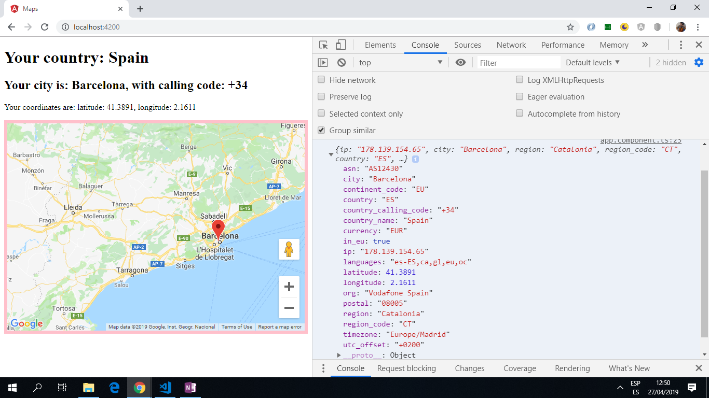

# :zap: Angular App Maps

* App using Angular 11, Angular Google Maps (AGM) and IPAPI.co to plot the user's location on a map.

*** Note: to open web links in a new window use: _ctrl+click on link_**

## :page_facing_up: Table of contents

* [:zap: Angular App Maps](#zap-angular-app-maps)
  * [:page_facing_up: Table of contents](#page_facing_up-table-of-contents)
  * [:books: General info](#books-general-info)
  * [:camera: Screenshots](#camera-screenshots)
  * [:signal_strength: Technologies](#signal_strength-technologies)
  * [:floppy_disk: Setup](#floppy_disk-setup)
  * [:computer: Code Examples](#computer-code-examples)
  * [:cool: Features](#cool-features)
  * [:clipboard: Status & To-Do List](#clipboard-status--to-do-list)
  * [:clap: Inspiration](#clap-inspiration)
  * [:envelope: Contact](#envelope-contact)

## :books: General info

* Angular httpClient used to get API data.

## :camera: Screenshots

.

## :signal_strength: Technologies

* [Angular v11](https://angular.io/)
* [RxJS Library v6](https://angular.io/guide/rx-library) used to [subscribe](http://reactivex.io/documentation/operators/subscribe.html) to the API data [observable](http://reactivex.io/documentation/observable.html)
* [Angular Google Maps (AGM) Core - Angular 2+ Google Maps components](https://www.npmjs.com/package/@agm/core)
* [ipapi](https://ipapi.co/) API to get IP address. The API can also get city, region , country , continent, postal code, latitude, longitude, timezone, utc_offset, european union (EU) membership, country calling code, currency, languages spoken, asn and organization. Free service but location given is actually the location of my internet service provider.

Http request with json format: GET `https://ipapi.co/json/`

* [Angular Google Maps](https://angular-maps.com/) component

## :floppy_disk: Setup

* Install dependencies using `npm i`
* Obtain your own API key for Google Cloud Platform Maps Javascript API and add to `app.module.ts`
* Run `ng serve` for a dev server.
* Navigate to `http://localhost:4200/`. The app does automatically reload if you change any of the source files.

## :computer: Code Examples

* extract from `maps.service.ts` using httpClient to get map location details from the API.

```typescript
interface Location {
  latitude: string;
  longitude: string;
  country_name: string;
  country_calling_code: string;
  city: string;
  ip: 0;
}
@Injectable({
  providedIn: 'root'
})

export class MapsService {
  constructor(private http: HttpClient) {}

  getLocation() {
    return this.http.get<Location>('https://ipapi.co/json/');
  }
}
```

## :cool: Features

* IPAPI API used to get ip and location data etc. in json format.
* Angular Google Maps used to accurately show user location on a map using the lat and longitude from IPAPI API.

## :clipboard: Status & To-Do List

* Status: Working.
* To-Do: nothing

## :clap: Inspiration

* [Coursetro Youtube video: Angular 7 Google Maps Tutorial with IPAPI (Plotting a User's Location)](https://www.youtube.com/watch?v=-IwTQgKIjCQ)
* [Academind: Google Maps & Angular | ANGULAR SNIPPETS](https://www.youtube.com/watch?v=lApggVS0icc) Using Google Maps

## :envelope: Contact

* Repo created by [ABateman](https://www.andrewbateman.org) - you are welcome to [send me a message](https://andrewbateman.org/contact)
